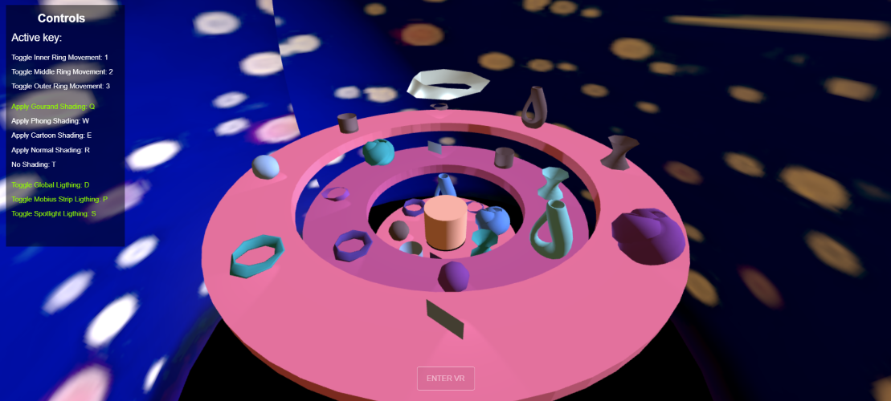

# Computer Graphics: Mathematical Carousel

This was the third project developed for the Computer Graphics course at Instituto Superior Técnico in the school year 2023/2024. It was made using the Three.js JavaScript library. It models a scene with a three revolving rings, each one with parametric geometries on top, in which we resorted to elements such as textures, lighting and materials. We also implemented support for VR devices.

It was developed by:

- [pedrofpclima](https://github.com/pedrofpclima)
- [dcaoc03](https://github.com/dcaoc03)
- [zecbfernandes](https://github.com/zecbfernandes)

The project was mostly done in English, while its guidelines were given in Portuguese.

Final Grade: 15.25

